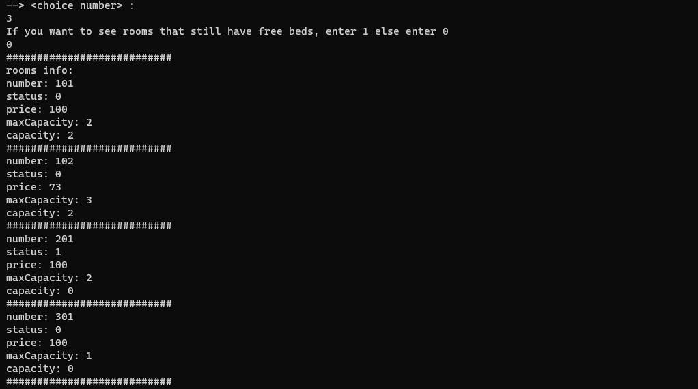

# CN_CHomeworks_1

**سنا ساری نوایی : 810199435**   
**مریم جعفرآبادی آشتیانی : 810199549**
<br/>
<br/>

## توضیحات اولیه راجع به منطق برنامه 
در این پروژه، به پیاده سازی یک سرور هتل می‌پردازیم. انواع درخواست‌ها از قبیل، رزرو، کنسل کردن رزرو، ویرایش اطلاعات و اطلاعات دیگر صورت میگیرد. برای هر موجودیت در برنامه کلاس های جداگانه در نظر گرفته شده است. که به شرح هرکدام میپردازیم.
<br/>

- readJson
- Server
- Client
- User
- Admin
- Rooms

### اول از توضیح کلاس `readJson` شروع میکنیم:  
این کلاس، کلاسی است که برنامه های ما با آن شروع میشود. داده های ما به صورت 3 فایل json است که RoomsInfo.json، config.json و UserInfo.json نام دارند. این کلاس اطلاعات را از این فایل ها دریافت میکند. `port` و `hostName` از فیلد های پرایوت کلاس هستند و توابع پابلیک این بخش برای نوشتن در فایل های جیسون پس از تغییر اطلاعات استفاده میشود. 


```cpp
class readJson
{
public:
    readJson();

    void write_signedup(std::string data);
    void write_editinfo(std::string data);
    void write_leaveroom(std::string data);
    void write_addroom(std::string data);
    void write_modifiedroom(std::string data);
    void write_deleteroom(std::string data);
    void write_booking(std::string data);
    void write_purse(std::string data);
    void write_cancel(std::string data);
    void write_numOfbeds(std::string data);
    void write_capacity(std::string data);

    int getPort();

    std::string getHostName();
    std::vector<User*> users;
    std::vector<Admin*> admins;
    std::vector<Rooms*> rooms;
private:
    std::string hostName;
    int port;
};
```

<br/>
<br/>

### کلاس `Server`:
این کلاس وظیفه ی هندل کردن سوکت ها را دارد. از طرف دیگر، توابعی که در این کلاس وجود دارند، دستور های مورد نظر ما را اجرا میکنند. 
    
```cpp
class Server
{
public:
    Server(readJson data);
    
    int setup_server(int port);
    
    void build();
    void signup(std::string username, std::string password, std::string purse, std::string phoneNumber, std::string address, int fd);
    void checkCommand(char buff[], int fd);
    void set_date(std::string day_, std::string month_, std::string year_);
    void checkusername(std::string name, int fd);
    void signin(std::string username, std::string password, int fd);
    void action_to_be_done(int choice, int id, int fd, std::istringstream& ss);
    void logout(int id, int fd);
    void edit_information(int id, int fd, std::istringstream &ss);
    void edit_rooms(int id, int fd, std::istringstream &ss);
    void leave_room(int id, int fd, std::istringstream &ss);
    void pass_day(int id, int fd, std::istringstream &ss);
    void handle_pass_day();
    void user_leave_room(int id, int fd, std::istringstream& ss);
    void admin_leave_room(int id, int fd, std::istringstream &ss);

    std::string get_info(int id);
    std::string user_info_gathering(int id);
    std::string rooms_info_gathering(int id, std::string command);
    std::string book(int id, std::istringstream& ss);
    std::string cancel(int id, std::istringstream& ss);
    std::string get_all_reservations(int id);

    bool checkDateFormat(const std::string& input, bool set_neede);
    bool checkIsANumber(std::string input, int fd);
    bool check_if_is_admin(int id);
    bool check_room_exist(std::string room_number);
    bool compare_date(std::string date);
private:
    
    readJson data;
    Date sys_date;
    std::vector<int> loggedInIds;
};
```
#### به بررسی توابع مهم در کلاس سرور میپردازیم:
<br/>
<br/>

تابع `()build` از مهمترین توابع در کلاس سرور میباشد. در اوایل این تابع، تابع `()setup_server` قرار دارد. این تابع در شکل زیر آمده است. با استفاده از سوکت، یک ارتباط TCP میسازیم. سپس bind میکنیم که به پورتی که دریافت کرده ایم، وصل شویم. در نهایت listen میکنیم تا درخواست ها از سمت کلاینت دریافت شود.  

```cpp
int Server::setup_server(int port)
{
    struct sockaddr_in address;
    int server_fd;
    server_fd = socket(AF_INET, SOCK_STREAM, 0);
    int opt = 1;
    setsockopt(server_fd, SOL_SOCKET, SO_REUSEADDR, &opt, sizeof(opt));
    
    address.sin_family = AF_INET;
    address.sin_addr.s_addr = INADDR_ANY;
    address.sin_port = htons(port);
    
    //check if there is more than one server running on the same port
    if (bind(server_fd, (struct sockaddr *)&address, sizeof(address)) < 0)
    {
        std::cout << "There is a server running on this port." << std::endl;
        exit(EXIT_FAILURE);
    }

    listen(server_fd, MAX_CLIENTS);

    return server_fd;
}
```
سپس به یک حلقه ی بی نهایت میرسیم که دو اتفاق ممکن است اتفاق بیفتد:  
یک: کلاینت جدیدی به سرور متصل شود. در صورتی که کلاینت جدید وارد شود، تابع `()acceptClient` فراخوانی میشود. این تابع بعدا توضیح داده میشود.  
دو: کلاینتی که قبلا متصل بوده، پیامی ارسال کند. در این حالت اگر تعداد بیتی که از کاربر دریافت شده صفر باشد، به این معناست که کاربر خارج شده و اطلاعاتش حذف میشود. در غیر اینصورت، وارد تابع `()checkCommand` میشود که خواسته های کاربر را بررسی میکند.

```cpp
while (true)
    {
        working_set = master_set;
        select(max_sd + 1, &working_set, NULL, NULL, NULL);

        for (int i = 0; i <= max_sd; i++)
        {
            if (FD_ISSET(i, &working_set))
            {
                if (i == server_fd) //new client
                {
                    int client_fd = acceptClient(server_fd);
                    FD_SET(client_fd, &master_set);
                    if (client_fd > max_sd)
                        max_sd = client_fd;
                }
                else //client is sending a message
                {
                    memset(buffer, 0, 5000);
                    int bytes_recieved = recv(i, buffer, 5000, 0);
                    if(bytes_recieved == 0)
                    {
                        std::cout << "client disconnected." << std::endl;
                        close(i);
                        FD_CLR(i, &master_set);
                        continue;
                    }
                    checkCommand(buffer,i);
                }
            }
        }
    }
```

تابع مهم بعدی، `()action_to_be_done` است. در این تابع، با توجه به کامند های مورد نظر، تابع مربوط به هر دستور که کاربر درخواست کرده را فراخوانی میکنیم. اینجا از switch case برای تشخیص دادن دستورات کاربر استفاده شده است. پس از انکه تابع مورد نظر فراخوانی شد، پاسخ از سمت سرور به کاربر ارسال میشود.  

```cpp
void Server::action_to_be_done(int choice, int id, int fd, std::istringstream& ss)
{
    switch(choice)
    {
        case 1: //View user information
        {
            std::string userORadmin_info;
            userORadmin_info = get_info(id);
            send(fd, userORadmin_info.c_str(), userORadmin_info.size(), 0);
            break;
        }
        case 2: //View all users
        {
            std::string info;
            if (check_if_is_admin(id))
            {
                info = user_info_gathering(id);
            }
            else
            {
                std::stringstream ss;
                ss << ERR403 << "/" << id << "/user";
                info = ss.str();
            }
            send(fd, info.c_str(), info.size(), 0);
            break;
        }
        case 3: //View rooms information
        {
            std::string rooms_info, command;
            std::getline(ss, command, '/'); //command
            rooms_info = rooms_info_gathering(id, command);
            send(fd, rooms_info.c_str(), rooms_info.size(), 0);
            break;
        }
        case 4: //Booking
        {
            std::string message;
            message = book(id, ss);
            send(fd, message.c_str(), message.size(), 0);
            break;
        }
        case 5: //Canceling
        {
            std::string reservation_info;
            reservation_info = get_all_reservations(id);
            send(fd, reservation_info.c_str(), reservation_info.size(), 0);
            break;
        }
        case 55:
        {
            std::string message;
            message = cancel(id, ss);
            send(fd, message.c_str(), message.size(), 0);
            break;
        }
        case 6:
            pass_day(id, fd, ss);
            break;
        case 7:
            edit_information(id, fd, ss);
            break;
        case 8:
            leave_room(id, fd, ss);
            break;
        case 9:
            edit_rooms(id, fd, ss);
            break;
        case 0:
            logout(id, fd);
            break;
    }
}
```

### کلاس `Client`:  
در این کلاس، مانند کلاس سرور، تابع `()build` نقش اساسی در client.cpp دارد(به علت طولانی بودن تابع، آن را قرار نمیدهیم و بخش های مهم آن را توضیح میدهیم).  
در ابتدای این تابع، `()connectServer` فراخوانی میشود که سعی میکند به سرور متصل شود. در صورتی که متصل نشد، خطایی چاپ میکنیم و به کاربر اطلاع میدهیم که ارتباط صورت نگرفته است. سپس در یک حلقه بی نهایت میرویم و در آنجا شرط های مختلف برای نشان دادن منوی اصلی و منوی کاربر را مشخص میکنیم.

```cpp
class Client
{
public:
    Client();
    void build();
    int connectServer(int port);
private:
    readJson data;
};
```

تابع `()connectServer` به صورت زیر است:

```cpp
int Client::connectServer(int port)
{
    int fd;
    struct sockaddr_in server_address;

    fd = socket(AF_INET, SOCK_STREAM, 0);

    server_address.sin_family = AF_INET;
    server_address.sin_port = htons(port);
    server_address.sin_addr.s_addr = inet_addr(data.getHostName().c_str());

    if (connect(fd, (struct sockaddr *)&server_address, sizeof(server_address)) < 0)
    { // checking for errors
        printf("Error in connecting to server\n");
    }

    return fd;
}
```
تابع مهم بعدی در `client.cpp`، تابع `()show_list` میباشد. در این تابع، منوی اولیه به کاربر نشون داده میشود. وقتی کلاینت بالا می‌آید، این منو نمایش داده میشود و کاربر میتواند ثبت نام یا لاگین کند و یا از برنامه خارج شود. با زدن هریک از کامندها ، وارد تابع مربوط به خودش میشود.  

```cpp
std::string show_list()
{
    std::cout << "Please choose one of the following commands:" << std::endl;
    std::cout << "signin <username> <password>" << std::endl;
    std::cout << "signup <username>" << std::endl;
    std::cout << "exit" << std::endl;

    std::string str;
    std::getline(std::cin >> std::ws, str);
    return str;
}
```
منوی بعدی، منویی است که کلاینت بعد از لاگین کردن مشاهده میکند. در این منو اطلاعاتی از قبیل نشان دادن اطلاعات یوزر، نشان دادن اطلاعات دیگر کاربران برای ادمین، نشان دادن اتاق های هتل، رزرو و کنسل کردن اتاق، شبیه سازی گذشت زمان، ویرایش اطلاعات کاربر، رفتن از اتاق هتل، ویرایش اتاق هتل و خروج از برنامه نمایش داده میشود. سپس کاربر میتواند از بین این کامندها یکی را انتخاب کند و وارد تابع مربوط به خودش بشود.  

```cpp
std::string user_list(int id, std::string user_admin)
{
    while(true)
    {
        std::cout << "Hi! Choose one of the items below by just entering the number of that.\n";
        std::cout << "1. View user information\n";
        std::cout << "2. View all users\n";
        std::cout << "3. View rooms information\n";
        std::cout << "4. Booking\n";
        std::cout << "5. Canceling\n";
        std::cout << "6. pass day\n";
        std::cout << "7. Edit information\n";
        std::cout << "8. Leaving room\n";
        std::cout << "9. Rooms\n";
        std::cout << "0. Logout\n";
        std::cout << "--> <choice number> :\n";
        std::string choice_num;
        std::getline(std::cin >> std::ws, choice_num);
        if (!isNumberBetween0And9(choice_num))
        {
            std::cout << ERR503 << std::endl;
            continue;               
        }
        else
        {
            if (stoi(choice_num) == 5)
            {
                if (user_admin != "user")
                    return "error403";
                return "menu/5/" + std::to_string(id);
            }
            return action_sentences(stoi(choice_num),id, user_admin);
        }
    }
    return "";
}
```

تابع مهم بعدی، تابع `()action_sentences` است که به علت طولانی بودن، از قرار دادن آن خودداری میکنیم و فقط منطق آن را توضیح میدهیم. در این بخش، یک switch case داریم و به ازای تمامی کامندها، بررسی میشود که ورودی های گرفته شده از کاربر به چه فرمتی باشد. همچنین در این بخش، استرینگی که به سرور فرستاده میشود نیز تنظیم میگردد. از طرف دیگر، هندل کردن ورودی های درست از کاربر نیز در این بخش انجام میشود.  

### کلاس `User`:

کلاس `User` حاوی اطلاعات یک کاربر در هتل است. توابعی که در بخش public قرار دارند، اطلاعات کاربر را فراخوانی میکنند یا این اطلاعات را تغییر میدهند. این اطلاعات شامل موارد زیر میباشد:

- `id`: شناسه کاربر
- `user`: نام کاربری
- `password`: رمز عبور
- `purse`: کیف پول
- `phoneNumber`: شماره تلفن
- `address`: آدرس

```cpp
class User
{
public:
    User(int id_, std::string user_, std::string password_, std::string purse_, std::string phoneNumber_, std::string address_);
    
    std::string getname();
    std::string getpassword();
    std::string getphone();
    std::string getaddress();
    std::string getpurse();
    
    void setpassword(std::string password_);
    void setaddress(std::string address_);
    void setphoneNumber(std::string phoneNumber_);
    void setpurse(std::string purse_);
    void cash_back(int cash);
    
    int getid();
private:
    int id;
    std::string user;
    std::string password;
    std::string purse;
    std::string phoneNumber;
    std::string address;
};
```

### کلاس `Admin`: 
در این کلاس اطلاعات ادمین نگه داری میشود. برای ادمین کلاس جدا از یوزر در نظر گرفتیم زیرا برای مواقعی که فقط با یوزر یا فقط با ادمین کار داریم، این کلاس ها را به صورت جداگانه میتوانیم استفاده کنیم. توابعی که در این کلاس استفاده شده است، مانند کلاس یوزر، شامل توابعی برای دسترسی به فیلد های پرایوت کلاس میباشد و تابع `()setpassword` برای تغییر دادن رمز استفاده میگردد. کلاس ادمین شامل این اطلاعات است:

- `id`: شناسه کاربر
- `user`: نام کاربری
- `password`: رمز عبور

```cpp
class Admin
{
public:
    Admin(int id_, std::string user_, std::string password_);

    std::string getname();
    std::string getpassword();

    int getid();
    
    void setpassword(std::string password_);
private:
    int id;
    std::string user;
    std::string password;
};
```

### کلاس `Rooms`:
این کلاس همانطور که از اسمش مشخص است، اطلاعات مربوط به اتاق ها را نگه میدارد. فیلد های پرایوت این کلاس، شامل ویژگی های هر اتاق است که در زیر آمده است. از طرف دیگر در این بخش یک وکتور تعریف شده است که اطلاعات مربوط به کاربرانی که در هر اتاق اقامت میکنند را نگه میدارد. توابع این کلاس، اطلاعات اتاق را فراخوانی میکنند یا این اطلاعات را تغییر میدهند. این اطلاعات شامل موارد زیر میباشد:

- `number`: شماره اتاق
- `status`: وضعیت اتاق
- `price`: قیمت اتاق به ازای هر نفر
- `maxCapacity`: ظرفیت حداکثر اتاق
- `capacity`: ظرفیت فعلی اتاق
- `userInRooms`: اطلاعات کاربرانی که در اتاق اقامت میکنند

```cpp
struct userInRoom
{
    int id;
    int numOfBeds;
    std::string reserveDate;
    std::string checkoutDate;
};

class Rooms
{
public:
    Rooms(std::string number_, int status_, int price_, int maxCapacity_, int capacity_, std::vector<userInRoom> userInRooms_);
    std::string getnum();
    
    int getstatus();
    int getprice();
    int getmax_capacity();
    int getcapacity();
    int get_numOfBeds(int index);

    std::vector<userInRoom> getusers();
    
    void set_price(int price_);
    void set_maxcap(int maxCapacity_);
    void set_capacity(int capacity_);
    void set_userInRooms(std::vector<userInRoom> userInRooms_);
    void set_status(int status_);
    void add_user(int id_, std::string numOfBeds_, std::string reserveDate_, std::string checkoutDate_);
    void change_capacity(int reduce_by);
    void del_reservation(int index);
    void set_numOfBeds(int index, int numOfBeds_);

private:
    std::string number;
    int status;
    int price;
    int maxCapacity;
    int capacity;
    std::vector<userInRoom> userInRooms;
};
```
## بررسی دستورات و مقادیر خروجی
در این بخش دستورات مختلف کد را توضیح میدهیم و همچنین از هر قسمت، خروجی متناظر را نمایش میدهیم. از طرف دیگر، به دلیل طولانی بودن توابع، از قرار دادن آنها خودداری میکنیم و به توضیح کامل از آنها میپردازیم.  

### دستور `setTime`:
این دستور، ابتدای شروع سرور استفاده میشود. با استفاده از این دستور، سرور زمان حال را انتخاب میکند. شرط هایی که برای چک کردن این قسمت در نظر گرفته ایم، شامل موارد زیر است:

**بررسی میکنیم که سال بین 1900 تا 2100 باشد**  
**ماه باید مقداری بین 1 تا 12 داشته باشد**  
**روز باید مقداری بین 1 تا 31 داشته باشد**  
**اندازه ورودی سال 4 و همچنین اندازه ورودی ماه و روز باید 2 باشد**  


### دستور `signup`:
وقتی کلاینت دستور `signup` را وارد کند، در سرور ابتدا چک میکنیم که نامی که کاربر انتخاب کرده، در لیست یوزرها قرار دارد یا خیر. اگر قرار نداشت، در اینصورت سایر اطلاعات را از کاربر میگیرد و عملیات ثبت نام را انجام میدهد. اما اگر اسم موردنظر در لیست موجود بود، ارور مربوطه را نشان میدهیم و به منوی اصلی برمیگردیم. شرط هایی که برای چک کردن این قسمت در نظر گرفته ایم، شامل موارد زیر است:

**بررسی میکنیم که نام کاربری وارد شده، در لیست یوزرها قرار نداشته باشد**  
**اگر کاربر به جای هر یک از اطلاعات موردنظر، چیزی وارد نکند و آن فیلد خالی باشد، ارور در نظر گرفتیم**  
**بررسی میکنیم که مقدار کیف پول و همچنین شماره کاربر به صورت رقم باشد در غیر اینصورت ارور دهد**  


### دستور `signin`:
با زدن این دستور، چک میکنیم که نام کاربری و رمز کاربر با یوزر موردنظر مطابقت داشته باشد. اگر مطابقت داشت، منوی کاربری را نشان میدهیم و اگر نداشت، ارور موردنظر با این بخش را چاپ میکنیم. شرط هایی که برای چک کردن این قسمت در نظر گرفته ایم، شامل موارد زیر است:

**چک میکنیم که نام کاربری و رمز عبور وارد شده در بین یوزرها و ادمین یافت میشود یا خیر**  

  

### دستور `View user information`:
در این بخش باید اطلاعات مربوط به کاربر موردنظر را نشان بدهیم. این دستور برای یوزر و ادمین اجرا میشود و اطلاعات فرد از قبیل آدرس، شماره تلفن، کیف پول و ... نمایش داده میشود و اگر فرد موردنظر ادمین باشد، اطلاعات مخصوص به ادمین مانند نام و پسورد نمایش داده میشود. در این قسمت شرط خاصی چک نمیشود فقط به ازای تمامی یوزرها، با استفاده از آیدی فرد موردنظر، میتوانیم آن را پیدا کنیم و اطلاعات مربوط به آن را نمایش دهیم.


### دستور `View all users`:
این بخش مربوط به ادمین است و کاربر باید با زدن این دستور خطا بگیرد. در این قسمت اطلاعات تمام کاربران بجز پسورد آنها برای ادمین نمایش داده میشود. شرط هایی که برای چک کردن این قسمت در نظر گرفته ایم، شامل موارد زیر است:

**بررسی میکنیم که کاربر ادمین باشد**
**اگر کاربر این دستور را وارد کند، ارور مربوط به این بخش را دریافت کند**

برای نشان دادن خروجی این بخش، وارد حساب کاربری ادمین با آیدی 0 شده ایم.  


### دستور `View Rooms Information`:
در این قسمت اطلاعات اتاق ها را نمایش میدهیم. بخش امتیازی این بخش این است که فقط اتاق های خالی نمایش داده شود که این قسمت را نیز هندل کردیم. به این صورت که وقتی کاربر کامند 3 را انتخاب کرد، بعد از آن میتواند انتخاب کند که کدام اتاق ها را ببیند. نکته دیگر این بخش این است که ادمین میتواند افراد هر اتاق را ببیند ولی یوزر نمیتواند. شرط هایی که در این قسمت در نظر گرفته ایم، شامل موارد زیر است:

**چک میکنیم کاربر میخواهد اتاق های خالی را ببیند یا تمایل به دیدن تمامی اتاق ها دارد.**  
**چک میکنیم کاربر موردنظر ادمین یا یوزر است، اگر ادمین باشد، باید اطلاعات افراد هر اتاق را نیز نمایش دهیم.**  




### دستور `book`:
در این قسمت کاربر میتواند اتاق موردنظر خود را با تاریخ و تعداد تخت دلخواه خودش رزرو کند. این قسمت شرط های زیادی دارد که در ادامه به آنها میپردازیم. شرط هایی که در این قسمت در نظر گرفته ایم، شامل موارد زیر است:

**چک میکنیم که کاربر مورد نظر ادمین نباشد**  
**چک میکنیم اتاق خواسته شده وجود داشته باشد**  
**اگر هر یک از داده های خواسته شده خالی یا نامناسب بود، ارور مربوط به خودش چاپ شود**  
**قبل از رزرو کردن، چک میکنیم فرد موردنظر به اندازه کافی پول داشته باشد**  
**چک میکنیم اتاق موردنظر در تاریخ موردنظر به اندازه خواسته شده، فضا داشته باشد**  
**چک میکنیم که تاریخ شروع اقامت از تاریخ الان قدیمی تر نباشد**  
**اگر تمامی شرط های بالا رعایت شد، سپس عمل رزرو انجام میشود. اگر تاریخ شروع اقامت از تاریخ الان جلوتر باشد، در اینصورت ظرفیت و استاتوس نیازی نیست تغییر بکنند**  


### دستور `cancel`:
در این دستور، کاربر عادی میتواند رزرو خود را لغو کند. اما به این نکته باید توجه داشت که فرض این است که زمانی قادر به انجام این کار میباشد که زمان شروع اقامتش فرا نرسیده باشد در غیر اینصورت ارور میگیرد. همچنین باید به این موضوع دقت کنیم که تعداد تخت هایی که کاربر میخواهد لغو کند، اگر کمتر از تعداد تخت هایی بود که رزرو کرده است، در اینصورت کافیست مقدار اختلاف را بدست آوریم و آپدیت کنیم. اگر این دو مقدار هم اندازه باشند، کل اطلاعات یوزر از آن اتاق حذف میشود و اگر تعداد تخت هایی که میخواهد لغو کند بیشتر از تعداد تخت های رزرو شده باشد، ارور مربوطه را نمایش میدهیم. شرط های این بخش در زیر آورده شده است:  

**چک میکنیم که کاربر مورد نظر ادمین نباشد**  
**چک میکنیم اتاق خواسته شده وجود داشته باشد**  
**چک کنیم رزرو موردنظر وجود دارد یا خیر**  
**اگر داده خواسته شده خالی یا غیرعددی بود، ارور دهد**  
**اگر تعداد تختی که میخواهیم کنسل کنیم، از تعداد تخت رزرو شده بیشتر باشد، خطا دهیم**  
**بررسی کنیم زمان شروع رزرو اتاق فرا رسیده است یا خیر**  
**اگر تعداد تختی که میخواهیم کنسل کنیم با تعداد تخت رزرو شده برابر باشد، آن کاربر را از لیست کاربران اتاق حذف میکنیم**  
**اگر تعداد تخت کنسلی از تخت رزرو کمتر باشد، در اینصورت کافیست مقدار تخت رزرو شده را تغییر دهیم**  


### دستور `passDay`:
در این قسمت ادمین میتواند به تعدادی که میخواهد، روز را به جلو ببرد. اگر کاربر عادی این دستور را وارد کند، خطا میگیرد. شرط هایی که در این قسمت در نظر گرفته ایم، شامل موارد زیر است:

**چک میکنیم که کاربر مورد نظر ادمین باشد**  
**اگر داده خواسته شده خالی یا غیرعددی بود، ارور دهد**  
**بررسی میکنیم داده وارد شده مثبت باشد، زیرا نمیتوانیم به عقب برگردیم**  
**چک میکنیم اگر به ازای روز اضافه شده، از تعداد روز های ماه فراتر رود یا تعداد ماه ها از 12 بیشتر شود، افزایش ماه یا سال خواهیم داشت**  
**پس از انجام تغییرات تاریخ، سراغ اتاق های هتل میرویم، آنهایی که تاریخ اقامتشان به پایان رسیده است را حذف میکنیم و اگر افرادی در این تاریخ اقامت رزرو کرده اند، استاتوس و ظرفیت اتاق ها را اپدیت میکنیم**  

client.cpp:  
  
server.cpp:  


### دستور `Edit information`:
در این بخش اگر کاربر، یوزر معمولی باشد، میتواند اطلاعاتی از قبیل رمز، شماره تلفن و آدرس را تغییر دهد ولی اگر ادمین باشد، تنها میتواند رمزش را عوض کند. بررسی میکنیم که تمامی اطلاعات وارد شده با اطلاعات قبلی کاربر یکسان نباشد. زیرا میخواهیم حداقل یکی از اطلاعات خواسته شده تغییر کنند و اگر کاربر همه اطلاعات را همان اطلاعات قبلی وارد کرد، به او خطا نمایش دهیم. شرط هایی که در این قسمت در نظر گرفته ایم، شامل موارد زیر است:  

**اگر کاربر معمولی باشد، شماره تلفن وارد شده حتما شامل عدد باشد**  
**تمامی اطلاعات وارد شده نباید با اطلاعات قبلی کاربر یکسان باشد**  

client.cpp  
  
UserInfo.json  
  

### دستور `leaving room`:  
این دستور شامل کاربر معمولی و ادمین میباشد. ابتدا بخش مربوط به کاربر معمولی را بررسی میکنیم:  

#### کاربر معمولی  
کاربر معمولی با زدن این دستور، میتواند اتاق را زودتر از زمان تخلیه، خالی کند. اما شرط هایی باید در اینجا چک شود. به عنوان مثال یکی از شرط های تخلیه کردن زودهنگام اتاق این است که از تاریخ رزرو این کاربر گذشته باشد. یعنی کاربر در اتاق اقامت داشته باشد و سپس قصد خروج از اتاق را داشته باشد. شرط هایی که در این قسمت چک میکنیم عبارتند از:  

**ورودی داده شده خالی نباشد**  
**چک میکنیم شماره اتاق وارد شده حتما به صورت عدد باشد**  
**با توجه به شماره اتاق بررسی میکنیم این اتاق وجود دارد یا خیر**  
**با توجه به آیدی فرد موردنظر بررسی میکنیم آیا این فرد در این اتاق قرار دارد یا خیر**  
**تاریخ شروع اقامت فرد موردنظر را با زمان حال مقایسه میکنیم. اگر اقامت فرد هنوز شروع نشده بود، ارور میدهیم**  


#### ادمین  
ادمین میتواند ظرفیت یک اتاق را به 0 برساند و همه افرادی که اتاق را رزرو کرده اند، را از اتاق حذف کند. برای آسانی کار، ظرفیت را 0 در نظر میگیریم(این مسئله در جلسه توجیحی گفته شده است) پس یکی از شرط های خطا برای مقدار ظرفیت این است که مخالف صفر باشد. از طرف دیگر بعد از اینکه ادمین این کامند را انتخاب کرد، در همان لحظه تمامی افراد اتاق موردنظر(در صورت وجود) از لیست افراد داخل آن اتاق حذف میشوند. شرط هایی که در این قسمت بررسی کرده ایم، در زیر آمده است:  

**ورودی داده شده خالی نباشد**  
**شماره اتاق و یا مقدار ظرفیت حتما مقدار عددی داشته باشند**  
**با توجه به شماره اتاق بررسی میکنیم این اتاق وجود دارد یا خیر**  
**با توجه به ظرفیت اتاق بررسی میکنیم آیا ظرفیت اتاق صفر است یا خیر**  
**چک میکنیم ظرفیت داده شده بیشتر از ظرفیت ماکسیمم اتاق نباشد**  


### دستور `Rooms`:
این  بخش از سه دستور تشکیل شده است که هرکدام به نوبت توضیح میدهیم.  
دستور اول مربوط به اضافه کردن اتاق است. شرط های این قسمت به شرح زیر میباشد:  

**چک میکنیم که کاربر موردنظر ادمین باشد**  
**ورودی های داده شده خالی نباشد**  
**چک میکنیم که تمامی فیلد های موردنظر، مقدار عددی داشته باشند**  
**بررسی میکنیم اتاق موردنظر وجود دارد یا خیر، اگر وجود داشت، ارور مربوط به خودش را میدهیم**  


دستور دوم مربوط به تغییرات یک اتاق است. شرط های این قسمت به شرح زیر میباشد:  

**چک میکنیم که کاربر موردنظر ادمین باشد**  
**ورودی های داده شده خالی نباشد**  
**چک میکنیم که تمامی فیلد های موردنظر، مقدار عددی داشته باشند**  
**بررسی میکنیم اتاق موردنظر وجود دارد یا خیر، اگر وجود نداشت، ارور مربوط به خودش را میدهیم**  
**بررسی میکنیم که اتاق ظرفیتش به طور کامل پر نباشد. زیرا در اینصورت نباید تغییری در اتاق صورت بگیرد**  
**چک میکنیم مقادیر وارد شده با مقادیر قبلی یکسان نباشند، اگر بود، ارور میدهیم**  


دستور سوم مربوط به حذف یک اتاق است که شرط های آن را بررسی میکنیم:  

**چک میکنیم که کاربر موردنظر ادمین باشد**  
**ورودی های داده شده خالی نباشد**  
**چک میکنیم که تمامی فیلد های موردنظر، مقدار عددی داشته باشند**  
**بررسی میکنیم اتاق موردنظر وجود دارد یا خیر، اگر وجود نداشت، ارور مربوط به خودش را میدهیم**  
**بررسی میکنیم که اتاق ظرفیتش به طور کامل پر نباشد. زیرا در اینصورت نباید تغییری در اتاق صورت بگیرد**  


### دستور `logout`:
این دستور برای خروج از حساب کاربری ست و پس از زدن این کامند، کاربر از حساب خود خارج میشود و منوی اولیه به او نشان داده میشود. همچنین این فرد را از لیست افرادی که لاگین کرده اند نیز حذف میکنیم. این قسمت شرط خاصی ندارد و نیاز به بررسی چیزی نیست.  


## پیام های خطا:  
همانطور که در پی دی اف ذکر شده است، به ازای خطاهای مختلف، باید پیام های خطای متفاوتی را به کاربر نشان دهیم. برای آسان شدن این کار، تمامی پیام های خطا به شکل زیر define شده اند و در مواجه با خطایی، پیام مربوط به آن را به کاربر نشان میدهیم. در قسمت قبل تمامی دستورات و شرط های آنها را بررسی کرده ایم. اگر شرطی برقرار نباشد، با استفاده از پیام های خطا، به کاربر اطلاع دهیم که چه خطایی رخ داده است. هدف از این کار این است که کاربر بتواند خطا را برطرف کند و دوباره دستور خود را اجرا کند.  


## جمع بندی:  
در این پروژه با برنامه نویسی سوکت و همچنین نحوه مبادله کردن پیام بین سرور و کلاینت آشنا شدیم. از طرف دیگر هندل کردن دستورات هتل نیز چالش دیگر این پروژه بود. علاوه بر آن، مدیریت
