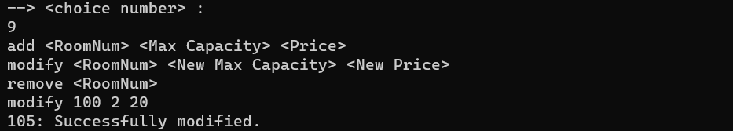

# CN_CHomeworks_1

**Maryam Jafarabadi Ashtiani : 810199549**  
**Sana Sari Navaei : 810199435**
<br/>
<br/>

## Basic explanations

In this project, we will implement a hotel server. All kinds of requests such as reservation, cancellation, editing of information and other information are made. Separate classes are considered for each entity in the program. We will describe each one.

-   readJson
-   Server
-   Client
-   User
-   Admin
-   Rooms

### First, we start by explaining the `readJson` class:

This class is the class with which our program begins. Our data is in the form of 3 json files named RoomsInfo.json, config.json and UserInfo.json. This class receives information from these files. `port` and `hostName` are private class fields and the public functions of this section are used to write to Jason files after changing the information.

```cpp
class readJson
{
public:
    readJson();

    void write_signedup(std::string data);
    void write_editinfo(std::string data);
    void write_leaveroom(std::string data);
    void write_addroom(std::string data);
    void write_modifiedroom(std::string data);
    void write_deleteroom(std::string data);
    void write_booking(std::string data);
    void write_purse(std::string data);
    void write_cancel(std::string data);
    void write_numOfbeds(std::string data);
    void write_capacity(std::string data);

    int getPort();

    std::string getHostName();
    std::vector<User*> users;
    std::vector<Admin*> admins;
    std::vector<Rooms*> rooms;
private:
    std::string hostName;
    int port;
};
```

<br/>
<br/>

### Class `Server`:

This class is responsible for handling sockets. On the other hand, the functions in this class execute the commands we want.

```cpp
class Server
{
public:
    Server(readJson data);

    int setup_server(int port);

    void build();
    void signup(std::string username, std::string password, std::string purse, std::string phoneNumber, std::string address, int fd);
    void checkCommand(char buff[], int fd);
    void set_date(std::string day_, std::string month_, std::string year_);
    void checkusername(std::string name, int fd);
    void signin(std::string username, std::string password, int fd);
    void action_to_be_done(int choice, int id, int fd, std::istringstream& ss);
    void logout(int id, int fd);
    void edit_information(int id, int fd, std::istringstream &ss);
    void edit_rooms(int id, int fd, std::istringstream &ss);
    void leave_room(int id, int fd, std::istringstream &ss);
    void pass_day(int id, int fd, std::istringstream &ss);
    void handle_pass_day();
    void user_leave_room(int id, int fd, std::istringstream& ss);
    void admin_leave_room(int id, int fd, std::istringstream &ss);

    std::string get_info(int id);
    std::string user_info_gathering(int id);
    std::string rooms_info_gathering(int id, std::string command);
    std::string book(int id, std::istringstream& ss);
    std::string cancel(int id, std::istringstream& ss);
    std::string get_all_reservations(int id);

    bool checkDateFormat(const std::string& input, bool set_neede);
    bool checkIsANumber(std::string input, int fd);
    bool check_if_is_admin(int id);
    bool check_room_exist(std::string room_number);
    bool compare_date(std::string date);
private:

    readJson data;
    Date sys_date;
    std::vector<int> loggedInIds;
};
```

#### We will examine the important functions in the server class:

<br/>
<br/>

`build()` is one of the most important functions in the server class. At the beginning of this function, the function `setup_server()` is located. This function is shown in the figure below. Using sockets, we create a TCP connection. Then we bind to connect to the received port. Finally, we listen until the requests are received from the client side.

```cpp
int Server::setup_server(int port)
{
    struct sockaddr_in address;
    int server_fd;
    server_fd = socket(AF_INET, SOCK_STREAM, 0);
    int opt = 1;
    setsockopt(server_fd, SOL_SOCKET, SO_REUSEADDR, &opt, sizeof(opt));

    address.sin_family = AF_INET;
    address.sin_addr.s_addr = INADDR_ANY;
    address.sin_port = htons(port);

    //check if there is more than one server running on the same port
    if (bind(server_fd, (struct sockaddr *)&address, sizeof(address)) < 0)
    {
        std::cout << "There is a server running on this port." << std::endl;
        exit(EXIT_FAILURE);
    }

    listen(server_fd, MAX_CLIENTS);

    return server_fd;
}
```

Then we reach an infinite loop where two things can happen:

-   Connect a new client to the server. If a new client is entered, the `acceptClient()` function is called. This function will be explained later.
-   The client that was already connected should send a message. In this case, if the number of bits received from the user is zero, it means that the user is logged out and his information is deleted. Otherwise, it enters the `checkCommand()` function, which checks the user's requests.

```cpp
while (true)
    {
        working_set = master_set;
        select(max_sd + 1, &working_set, NULL, NULL, NULL);

        for (int i = 0; i <= max_sd; i++)
        {
            if (FD_ISSET(i, &working_set))
            {
                if (i == server_fd) //new client
                {
                    int client_fd = acceptClient(server_fd);
                    FD_SET(client_fd, &master_set);
                    if (client_fd > max_sd)
                        max_sd = client_fd;
                }
                else //client is sending a message
                {
                    memset(buffer, 0, 5000);
                    int bytes_recieved = recv(i, buffer, 5000, 0);
                    if(bytes_recieved == 0)
                    {
                        std::cout << "client disconnected." << std::endl;
                        close(i);
                        FD_CLR(i, &master_set);
                        continue;
                    }
                    checkCommand(buffer,i);
                }
            }
        }
    }
```

The next important function is `action_to_be_done()`. In this function, according to the desired commands, we call the function corresponding to each command requested by the user. Here, switch case is used to recognize user commands. After the desired function is called, the response is sent from the server side to the user.

```cpp
void Server::action_to_be_done(int choice, int id, int fd, std::istringstream& ss)
{
    switch(choice)
    {
        case 1: //View user information
        {
            std::string userORadmin_info;
            userORadmin_info = get_info(id);
            send(fd, userORadmin_info.c_str(), userORadmin_info.size(), 0);
            break;
        }
        case 2: //View all users
        {
            std::string info;
            if (check_if_is_admin(id))
            {
                info = user_info_gathering(id);
            }
            else
            {
                std::stringstream ss;
                ss << ERR403 << "/" << id << "/user";
                info = ss.str();
            }
            send(fd, info.c_str(), info.size(), 0);
            break;
        }
        case 3: //View rooms information
        {
            std::string rooms_info, command;
            std::getline(ss, command, '/'); //command
            rooms_info = rooms_info_gathering(id, command);
            send(fd, rooms_info.c_str(), rooms_info.size(), 0);
            break;
        }
        case 4: //Booking
        {
            std::string message;
            message = book(id, ss);
            send(fd, message.c_str(), message.size(), 0);
            break;
        }
        case 5: //Canceling
        {
            std::string reservation_info;
            reservation_info = get_all_reservations(id);
            send(fd, reservation_info.c_str(), reservation_info.size(), 0);
            break;
        }
        case 55:
        {
            std::string message;
            message = cancel(id, ss);
            send(fd, message.c_str(), message.size(), 0);
            break;
        }
        case 6:
            pass_day(id, fd, ss);
            break;
        case 7:
            edit_information(id, fd, ss);
            break;
        case 8:
            leave_room(id, fd, ss);
            break;
        case 9:
            edit_rooms(id, fd, ss);
            break;
        case 0:
            logout(id, fd);
            break;
    }
}
```

### Class `Client`:

In this class, like the server class, `build()` function plays an essential role in client.cpp (due to the length of the function, we will not include it and explain its important parts).  
At the beginning of this function, `connectServer()` is called to try to connect to the server. If it is not connected, we will print an error and inform the user that the connection has not been established. Then we go in an infinite loop and specify different conditions to show the main menu and the user menu.

```cpp
class Client
{
public:
    Client();
    void build();
    int connectServer(int port);
private:
    readJson data;
};
```

The `connectServer()` function is as follows:

```cpp
int Client::connectServer(int port)
{
    int fd;
    struct sockaddr_in server_address;

    fd = socket(AF_INET, SOCK_STREAM, 0);

    server_address.sin_family = AF_INET;
    server_address.sin_port = htons(port);
    server_address.sin_addr.s_addr = inet_addr(data.getHostName().c_str());

    if (connect(fd, (struct sockaddr *)&server_address, sizeof(server_address)) < 0)
    { // checking for errors
        printf("Error in connecting to server\n");
    }

    return fd;
}
```

The next important function in client.cpp is the `show_list()` function. In this function, the primary menu is shown to the user. When the client comes up, this menu is displayed and the user can register or log in or exit the program. By typing each of the commands, it enters its corresponding function.

```cpp
std::string show_list()
{
    std::cout << "Please choose one of the following commands:" << std::endl;
    std::cout << "signin <username> <password>" << std::endl;
    std::cout << "signup <username>" << std::endl;
    std::cout << "exit" << std::endl;

    std::string str;
    std::getline(std::cin >> std::ws, str);
    return str;
}
```

The next menu is the menu that the client sees after logging in. In this menu, information such as showing user information, showing other users information for the admin, showing hotel rooms, booking and canceling rooms, simulating the passage of time, editing user information, leaving the hotel room, editing the hotel room, and exiting. It is displayed from the program. Then the user can choose one of these commands and enter the corresponding function.

```cpp
std::string user_list(int id, std::string user_admin)
{
    while(true)
    {
        std::cout << "Hi! Choose one of the items below by just entering the number of that.\n";
        std::cout << "1. View user information\n";
        std::cout << "2. View all users\n";
        std::cout << "3. View rooms information\n";
        std::cout << "4. Booking\n";
        std::cout << "5. Canceling\n";
        std::cout << "6. pass day\n";
        std::cout << "7. Edit information\n";
        std::cout << "8. Leaving room\n";
        std::cout << "9. Rooms\n";
        std::cout << "0. Logout\n";
        std::cout << "--> <choice number> :\n";
        std::string choice_num;
        std::getline(std::cin >> std::ws, choice_num);
        if (!isNumberBetween0And9(choice_num))
        {
            std::cout << ERR503 << std::endl;
            continue;
        }
        else
        {
            if (stoi(choice_num) == 5)
            {
                if (user_admin != "user")
                    return "error403";
                return "menu/5/" + std::to_string(id);
            }
            return action_sentences(stoi(choice_num),id, user_admin);
        }
    }
    return "";
}
```

The next important function is `action_sentences()` function, which we refrain from including due to its length and only explain its logic. In this section, we have a switch case and for all the commands, it is checked what format the inputs taken from the user are. Also, in this section, the string that is sent to the server is also set. On the other hand, handling correct inputs from the user is also done in this section.

### Class `User`:

`User` class contains the information of a user in the hotel. The functions that are in the public section call the users information or change this information. This information includes the following:

-   `id`
-   `user`
-   `password`
-   `purse`
-   `phoneNumber`
-   `address`

```cpp
class User
{
public:
    User(int id_, std::string user_, std::string password_, std::string purse_, std::string phoneNumber_, std::string address_);

    std::string getname();
    std::string getpassword();
    std::string getphone();
    std::string getaddress();
    std::string getpurse();

    void setpassword(std::string password_);
    void setaddress(std::string address_);
    void setphoneNumber(std::string phoneNumber_);
    void setpurse(std::string purse_);
    void cash_back(int cash);

    int getid();
private:
    int id;
    std::string user;
    std::string password;
    std::string purse;
    std::string phoneNumber;
    std::string address;
};
```

### Class `Admin`:

Admin information is kept in this class. We considered a separate class for the admin from the user because we can use these classes separately for the times when we only work with the user or only with the admin. The functions used in this class, such as the user class, include functions to access the private fields of the class, and the `setpassword()` function is used to change the password. Admin class includes this information:

-   `id`
-   `user`
-   `password`

```cpp
class Admin
{
public:
    Admin(int id_, std::string user_, std::string password_);

    std::string getname();
    std::string getpassword();

    int getid();

    void setpassword(std::string password_);
private:
    int id;
    std::string user;
    std::string password;
};
```

### Class `Rooms`:

This class stores information about rooms. The private fields of this class include the features of each room, which are listed below. On the other hand, in this section, a vector is defined that keeps the information about the users staying in each room. The functions of this class call the room information or change this information. This information includes the following:

-   `number`
-   `status`
-   `price`
-   `maxCapacity`
-   `capacity`
-   `userInRooms`

```cpp
struct userInRoom
{
    int id;
    int numOfBeds;
    std::string reserveDate;
    std::string checkoutDate;
};

class Rooms
{
public:
    Rooms(std::string number_, int status_, int price_, int maxCapacity_, int capacity_, std::vector<userInRoom> userInRooms_);
    std::string getnum();

    int getstatus();
    int getprice();
    int getmax_capacity();
    int getcapacity();
    int get_numOfBeds(int index);

    std::vector<userInRoom> getusers();

    void set_price(int price_);
    void set_maxcap(int maxCapacity_);
    void set_capacity(int capacity_);
    void set_userInRooms(std::vector<userInRoom> userInRooms_);
    void set_status(int status_);
    void add_user(int id_, std::string numOfBeds_, std::string reserveDate_, std::string checkoutDate_);
    void change_capacity(int reduce_by);
    void del_reservation(int index);
    void set_numOfBeds(int index, int numOfBeds_);

private:
    std::string number;
    int status;
    int price;
    int maxCapacity;
    int capacity;
    std::vector<userInRoom> userInRooms;
};
```

## Reviewing Commands and Output Values

In this section, we explain various code commands and display their corresponding outputs. However, due to their length, we refrain from including the functions themselves and provide a comprehensive explanation instead.

### Command `setTime`:

This command is used at the beginning of the server to set the current time. The conditions we consider for checking this section are as follows:

**We check that the year is between 1900 and 2100.**  
**The month must have a value between 1 and 12.**  
**The day must have a value between 1 and 31.**  
**The input size for the year must be 4, and the input size for the month and day must be 2.**


### Command `signup`:

When the client enters the `signup` command, we first check on the server whether the name chosen by the user is in the list of users or not. If it is not there, then it takes other information from the user and performs the registration operation. But if the desired name was in the list, we will show the corresponding error and return to the main menu. The conditions we have considered for checking this section include the following:

**We check that the entered username is not in the list of users**
**If the user does not enter anything instead of any of the desired information and that field is empty, we considered an error**
**We check that the amount of the wallet as well as the user number is in the form of digits, otherwise it will give an error**


### Command `singin`:

By typing this command, we check that the user's username and password match the user's comment. If it matches, we show the user menu and if it doesn't match, we print the desired error with this section. The conditions considered for checking this section include the following:

**We check whether the entered username and password can be found among users and admin**


### Command `View user information`:

In this section, we must show information about the desired user. This command is executed for the user and the administrator, and the person's information such as address, phone number, wallet, etc. is displayed, and if the desired person is an administrator, the information specific to the administrator, such as name and password, is displayed. In this section, no special condition is checked, only for all users, we can find it and display related information by using the ID of the desired person.


### Command `View all users`:

This section is related to the admin and the user should get an error by typing this command. In this section, the information of all users except their password is displayed for the admin. The conditions we have considered for checking this section include the following:

**We check that the user is admin**  
**If the user enters this command, he will receive the error related to this section**

To show the output of this section, we have entered the admin user account with ID 0.  


### Command `View Rooms Information`:

In this section, we display the information of the rooms. The bonus part of this section is to show only empty rooms, which we also handled. In this way, when the user selects command 3, he can choose which rooms to see. Another point of this section is that the admin can see the people of each room, but the user cannot. The conditions that we have considered in this section include the following:

**We check if the user wants to see the empty rooms or wants to see all the rooms.**
**We check if the desired user is an admin or a user, if it is an admin, we must also display the information of the people in each room.**


### Command `book`:

In this section, the user can book the desired room with the desired date and number of beds. This part has many conditions that we will discuss further. The conditions that we have considered in this section include the following:

**We check that the target user is not an admin**  
**We check if the requested room exists**  
**If any of the requested data is empty or inappropriate, the corresponding error will be printed**  
**Before making a reservation, we check that the person in question has enough money**  
**We will check if the desired room has the requested size on the desired date**  
**We check that the start date of the stay is not older than the current date**  
**If all the above conditions are met, then the reservation will be done. If the start date of the stay is earlier than the current date, then the capacity and status do not need to be changed**


### Command `cancel`:

In this command, the normal user can cancel his reservation. But it should be noted that it is assumed that he is able to do this when the time to start his stay has not arrived, otherwise he will get an error. We should also pay attention to the fact that if the number of beds that the user wants to cancel is less than the number of beds that he has reserved, then it is enough to get the difference and update it. If these two values are the same, the user's entire information will be deleted from that room, and if the number of beds he wants to cancel is more than the number of reserved beds, we will display the corresponding error. The terms of this section are given below:

**We check that the target user is not an admin**  
**We check if the requested room exists**  
**Let's check if the desired reservation exists or not**  
**If the requested data is empty or non-numeric, return an error**  
**If the number of beds we want to cancel is more than the number of reserved beds, we will give an error**  
**Let's check whether it is time to start booking the room or not**  
**If the number of beds we want to cancel is equal to the number of reserved beds, we will remove that user from the list of room users**  
**If the number of canceled beds is less than the number of reserved beds, then it is enough to change the amount of reserved beds**


### Command `passDay`:

In this section, the admin can advance the day as many times as he wants. If a normal user enters this command, he will get an error. The conditions that we have considered in this section include the following:

**We check that the target user is an admin**  
**If the requested data is empty or non-numeric, return an error**  
**We check that the entered data is positive, because we can't go back**  
**we check if the added day exceeds the number of days in the month or the number of months exceeds 12, we will increase the month or year**  
**After changing the dates, we go to the hotel rooms, delete those whose dates of stay have ended, and if people have made reservations on this date, we update the status and capacity of the rooms**

client.cpp:  
  
server.cpp:  


### Command `Edit information`:

In this section, if the user is a normal user, he can change information such as password, phone number, and address, but if he is an administrator, he can only change his password. We check that all the entered information is not the same as the user's previous information. Because we want to change at least one of the requested information and show an error if the user enters all the same information as before. The conditions that we have considered in this section include the following:

**If the user is a normal user, the entered phone number must contain numbers**  
**All entered information must not be the same as the user's previous information**

client.cpp  
  
UserInfo.json  


### Command `leaving room`:

This command includes normal user and admin. First, let's check the section related to the normal user:

#### Normal user

By typing this command, the normal user can empty the room earlier than the emptying time. But there are conditions to be checked here. For example, one of the conditions for early vacating the room is that the reservation date of this user has passed. It means that the user stays in the room and then intends to leave the room. The terms we check in this section are:

**Input should not be empty**  
**We will check that the entered room number must be a number**  
**According to the room number, we will check if this room exists or not**  
**According to the ID of the person in question, we will check if this person is in this room or not**  
**We compare the start date of the desired person's stay with the current time. If the person's stay has not started yet, we will give an error**


#### Admin

Admin can reduce the capacity of a room to 0 and remove all the people who have reserved the room from the room. For ease of work, we consider the capacity to be 0 (this problem was mentioned in the clarification session), so one of the error conditions for the capacity value is that it is opposite to zero. On the other hand, after the admin selects this command, all the people in the desired room (if any) will be removed from the list of people in that room. The terms we have reviewed in this section are as follows:

**Input should not be empty**  
**The room number or the capacity must have a numeric value**  
**According to the room number, we will check if this room exists or not**  
**According to the room capacity, we check whether the room capacity is zero or not**  
**We check that the given capacity is not more than the maximum capacity of the room**


### Command `Rooms`:

This section consists of three commands, each of which we explain in turn.  
The first command is about adding a room. The terms of this section are as follows:

**We check that the desired user is an admin**  
**Given entries should not be empty**  
**We check that all the desired fields have a numerical value**  
**We will check whether the desired room exists or not, if it exists, we will give the corresponding error**


The second order is related to changes in a room. The terms of this section are as follows:

**We check that the desired user is an admin**  
**Given entries should not be empty**  
**We check that all the desired fields have a numerical value**  
**We check whether the desired room exists or not, if it does not exist, we give the corresponding error**  
**We check that the capacity room is not completely full. Because in this case, there should be no change in the room**  
**We check that the entered values are not the same as the previous values, if they are, we will give an error**




The third command is related to the removal of a room, which we check its conditions:

**We check that the desired user is an admin**  
**Given entries should not be empty**  
**We check that all the desired fields have a numerical value**  
**We check whether the desired room exists or not, if it does not exist, we give the corresponding error**  
**We check that the capacity room is not completely full. Because in this case, there should be no change in the room**


### Command `logout`:

This command is for logging out of the user account and after typing this command, the user will log out of his account and the main menu will be shown to him. We will also remove this person from the list of people who have logged in. This part does not have any special conditions and there is no need to check anything.


## Error messages:

As mentioned in the PDF, for different errors, we need to show different error messages to the user. To make this easy, all the error messages are defined as follows, and in case of an error, we show the corresponding message to the user. In the previous part, we have reviewed all the orders and their conditions. If a condition is not met, use error messages to inform the user what error has occurred. The purpose of this is to allow the user to fix the error and re-execute their command.


## Conclusion:

In this project, we learned about socket programming and how to exchange messages between the server and the client. On the other hand, handling hotel orders was another challenge of this project.
